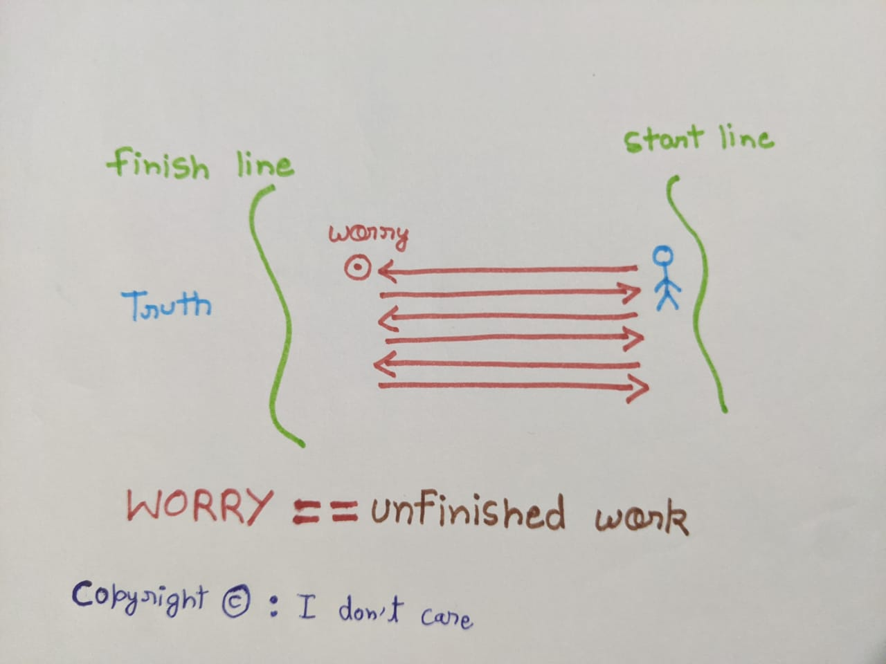

# Worry : Unfinished work 

##### 25  Apr  2023

#### some people easily gets worried , even for the simplest of uncertainties 
#### They are THE EXPERTS in finding the slightest reasons to get worried [it's me] .

***

#### DEFINING : ( to say exactly what a word or idea means ) , certainly helps !!!

#### let's try to define worry 

#### **WORRY : Constantly visiting an idea/though without getting a TRUE conclusion .**

#### Worry is mostly Subconscious  or At best half processed thoughts . This is why it's so unproductive ,coz we are running in circles .

***

### Approach :
1. As soon as you starts feeling worry/Anxiety remind yourself that there are some unprocessed thoughts , and make it conscious .
2. Once you know that something is bothering you , try to define in as much detail as possible , include every (detail/possibility).
3. Put those details into three buckets :
    - In my control
    - With effort can be in my control 
    - can-never be in my control
4. Act on first and second bucket and ignore the last bucket .

after acting on these 4 steps for some time , either of 2 things will happen
1. your assumption were correct , you actually solved the problem .[ MATTER CLOSED ] [ FINISHED COMPUTATION ] [ YOU WILL FEEL STRONG ]
2. your assumption were incorrect , you sidestepped actual problem.[ MATTER STILL OPEN ] [ VISIT STEPS AGAIN ] [ YOU WILL FEEL BETTER ]
 
***
#### People refer doining these steps as "fighting" and vice-versa . It better to fight then running in circles .
#### Coz , Something these Subconscious junk can eat our decades .[as they took mine]

 

